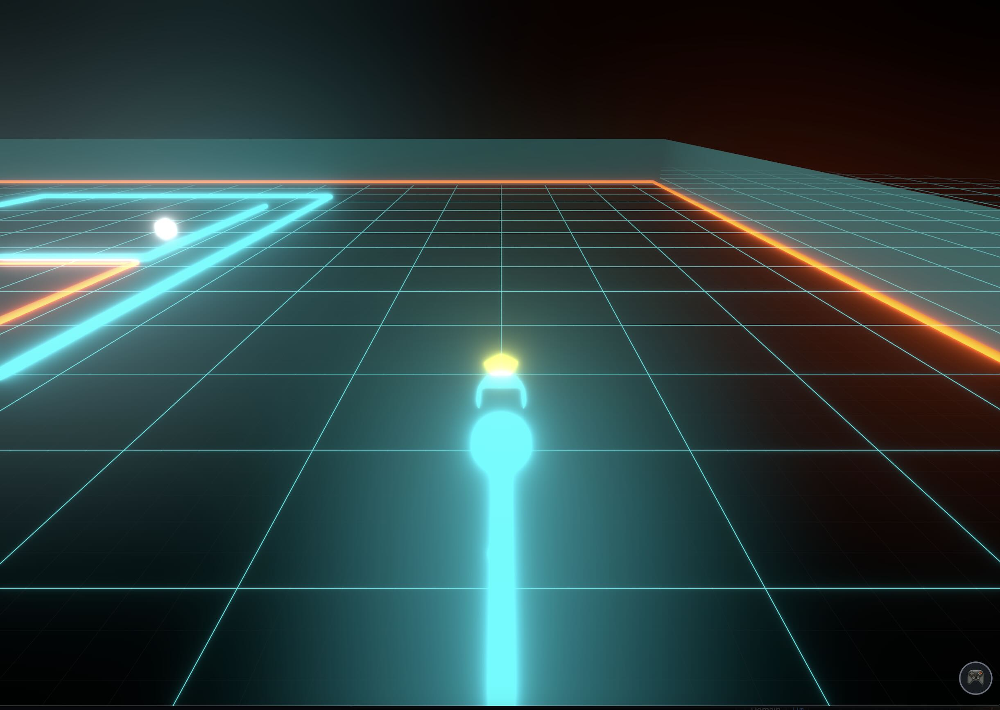

  

# Basic Tron : an experiment with Google AI Studio

## Disclaimer

These days, I have been watching the old Tron movies - thanks to a friend who got me to watch [Tron: Ares](https://www.imdb.com/title/tt6604188).

It's interesting how the 1982 movie is so much more forward thinking in terms of machines and AI. A discussion that was probably forgotten by many but which is interesting in the current AI revolution / bubble :

> **Alan Bradley:**  
> I tell you, ever since he got that **M**aster **C**ontrol **P**rogram, system's got more bugs than a bait store.

(Hi [Claude MCP](https://www.anthropic.com/news/model-context-protocol) !)

> **Dr. Walter Gibbs:**  
> Gotta expect some static. After all, computers are just machines. They can't think.

> **Alan Bradley:**  
> Some programs will be thinking soon.

> **Dr. Walter Gibbs:**  
> Won't that be grand? Computers and the programs will start thinking and the people will stop.

[Tron, 1982](https://www.imdb.com/title/tt0084827)

In any case, I decide to try the Google AI Studio vibe coding for this. Didn't spend much time, it's more a side side silly project. 

## Initial prompt
*Build a mobile first web app to play the game Tron. Use SOTA UI/UX and leverage existing free 3D models of the bike.*

Note : SOTA = State Of The Art

## Quick opinion on Google AI Studio
Google LLMs (gemini) still have big issues in actually calling tools. Many times I had to remind it that *he thought about a solution* but didn't *implement it* ! I find it surprising that such an app coming from Google wouldn't be more robust. But yes, in the end, you can vibe code with it - just be prepared to some frustration. My copy/paste prompt : "*you forgot to update the codes !*"

In fact, to deploy it as a GitHub Pages, I had to use claude to correct some files.. Google AI Studio also propose deployments and it would have probably work directly there, but it asked for billing information and decided it was too much for a test.

PS : for those who know me, I am fascinated by the [Qwen3 next 80b](https://www.qwen3-next.org/) model which is capable to one shot a number of complicated programs - the Tron game as well. I will write about it later, on medium or arxiv.org, but I have gain the certainty that open source actually won the battle of LLMs. OpenAI, Anthropic or Google will just have better ecosystems of solutions and packaging.

## Music

The background music [Neon Reverie](assets/neon_reverie.mp3) was created with [Suno](https://suno.com/s/YL4CceFyzxQp2e9e) using the simple prompt: "electronic, dynamic music based on Tron movies and universe".

## Sound Effects (WIP)

The few sound effects were generated with [ElevenLabs Text-to-sound-effects](https://elevenlabs.io/sound-effects). Examples:

> crash and explosion of a high speed Tron bike on a high energy electromagnetic wall

> sci fi bike power up

## Run and deploy basic-tron

This contains everything you need to run your app locally.

### Run on the web

https://www.lpalbou.info/basic-tron/

### Run Locally

**Prerequisites:**  Node.js

1. Install dependencies:
   `npm install`
2. Set the `GEMINI_API_KEY` in [.env.local](.env.local) to your Gemini API key
3. Run the app:
   `npm run dev`
