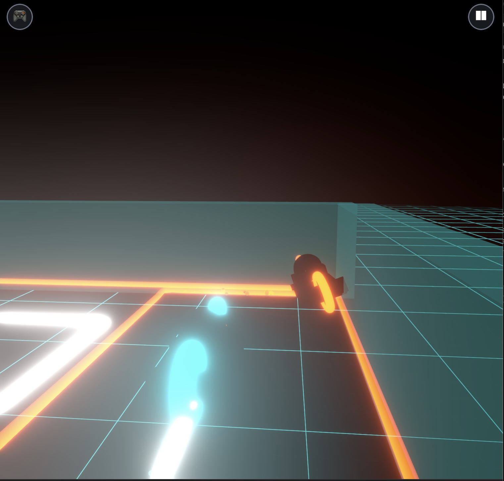
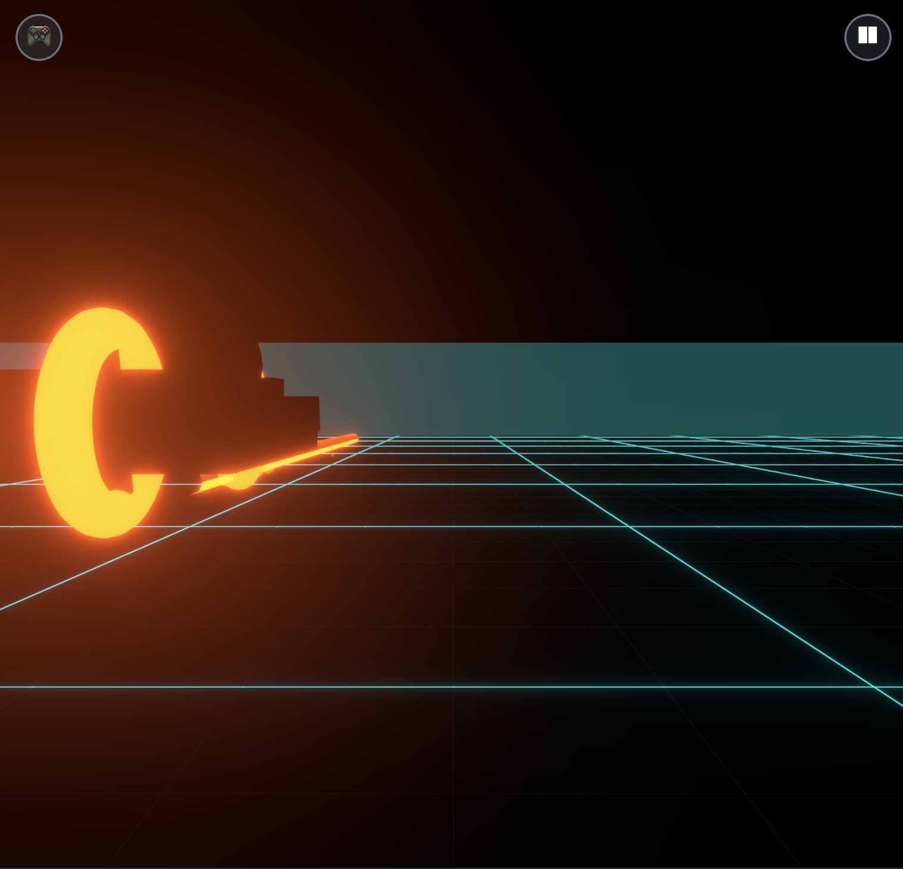
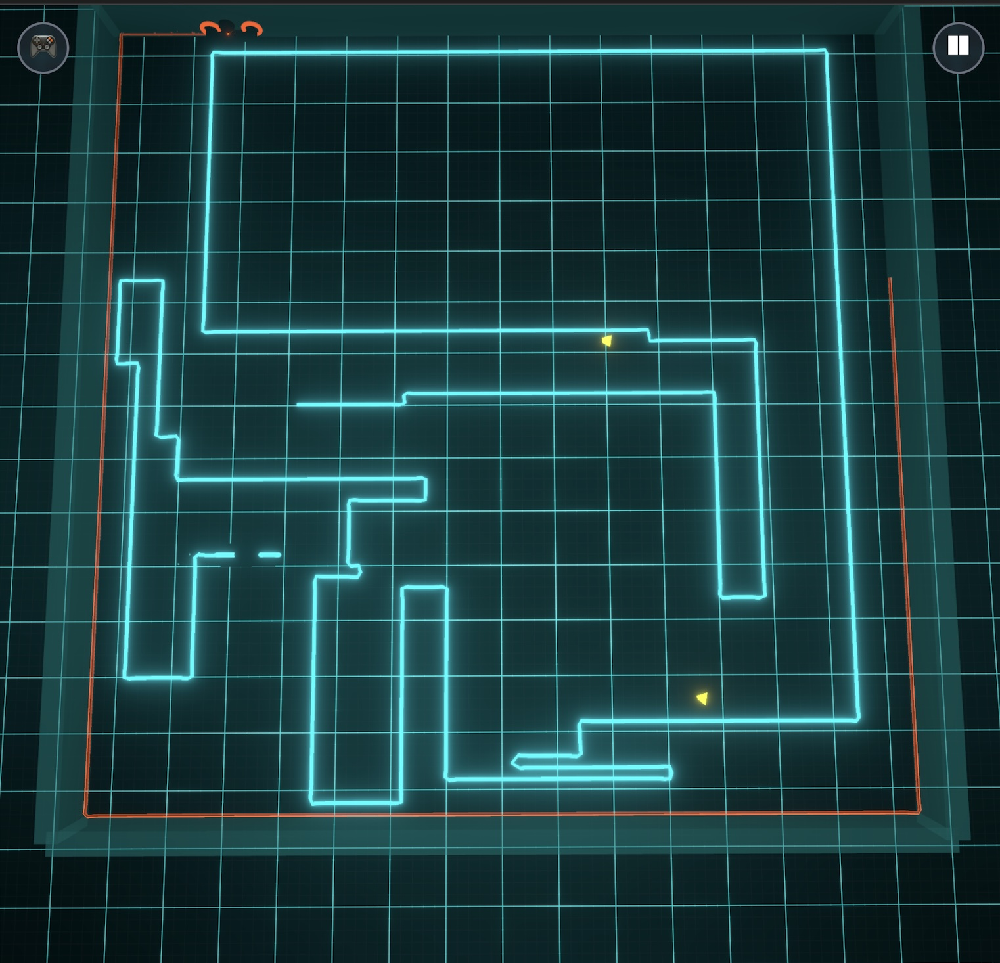
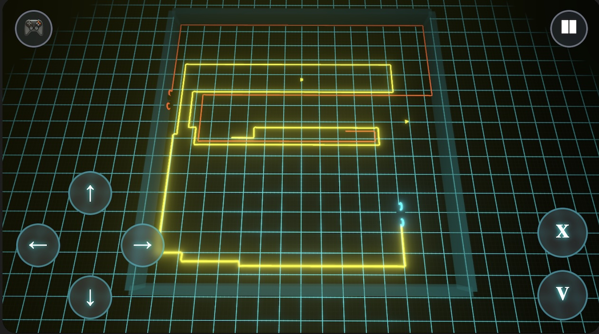

<div align="center">

# 🏍️ **Basic Tron** 
### *An AI-Powered Light Cycle Experience*

[](https://www.lpalbou.info/basic-tron/)
[](https://aistudio.google.com/)

---

## 📋 **Document Overview**

This README is organized into **two distinct parts**:

### 🎮 **[Part I: The Game](#-part-i-the-game)**
*Complete presentation of Basic Tron - features, gameplay, controls, and mechanics*
- Multiple camera perspectives and screenshots
- Game features and controls
- Core gameplay mechanics and power-ups
- How to play and run locally

### 🤖 **[Part II: The AI Experiment](#-part-ii-the-google-ai-experiment)** 
*Technical exploration of AI-assisted development and content creation*
- Google AI Studio development experience
- AI-generated music and sound effects
- Lessons learned and technical insights
- Comparison with other AI tools

### ⚡ **[Part III: Better Vibe Coding](#-part-iii-better-vibe-coding)**
*Leveling up the development process with next-gen AI tools and smooth local deployment*
- Building features using Cursor and Claude 4 Sonnet for rapid prototyping and smarter code assistance
- Refined workflow: from idea to implementation, with smoother iteration and debugging
- Significantly lighter on resources: With Google AI Studio, my MBP M4 Max’s CPU would spike to 500% usage. Now, with local development and deployment, it rarely exceeds 50%.
- Easily run your project locally for testing using  
  ```bash
  npm run build:local
  cd dist
  lsof -ti:8080 | xargs kill -9 && python -m http.server 8080
  ```
  to serve the build for quick device testing

---

# 🎮 **PART I: THE GAME**

## 🎯 **Multiple Camera Perspectives**
*Experience the Grid from every angle*

<table>
<tr>
<td width="50%">

<h4 align="center">🎬 <strong>Follow Camera</strong></h4>
<p align="center"><em>Chase the light cycle from behind</em></p>
</td>
<td width="50%">

<h4 align="center">👁️ <strong>First Person</strong></h4>
<p align="center"><em>Feel the speed from the cockpit</em></p>
</td>
</tr>
</table>

<table>
<tr>
<td width="50%">

<h4 align="center">🗺️ <strong>Top-Down</strong></h4>
<p align="center"><em>Master the arena with tactical view</em></p>
</td>
<td width="50%">

<h4 align="center">📱 <strong>Mobile UI</strong></h4>
<p align="center"><em>Optimized touch controls for mobile & tablet</em></p>
</td>
</tr>
</table>

---

## ✨ **Features**

🎮 **Multi-Platform Gaming** • Seamless experience across desktop, mobile & tablet  
🎥 **Dynamic Cameras** • Switch between Follow, FPV, and Top-Down views  
🎵 **AI-Generated Audio** • Immersive soundtrack and sound effects  
⚡ **Real-Time Physics** • Smooth light cycle movement and collision detection  
🌟 **Power-Ups** • Strategic gameplay elements  
🎨 **Neon Aesthetics** • Authentic Tron-inspired visual design  

---

## ⌨️ **Keyboard Controls**
*Master the Grid with these shortcuts*

<table>
<tr>
<td align="center" width="33%">
<kbd>X</kbd><br/>
<strong>Speed Control</strong><br/>
<em>0.5x → 1x → 1.5x → 2x</em><br/>
<small>Default: 1x</small>
</td>
<td align="center" width="33%">
<kbd>V</kbd><br/>
<strong>Camera View</strong><br/>
<em>Follow → FPV → Top-Down</em><br/>
<small>Cycle through perspectives</small>
</td>
<td align="center" width="33%">
<kbd>P</kbd><br/>
<strong>Pause Game</strong><br/>
<em>Freeze the action</em><br/>
<small>Resume anytime</small>
</td>
</tr>
</table>

> 💡 **Pro Tip:** Use speed control strategically - slower speeds for tight maneuvers, faster for open areas!

---

## 🎯 **Game Mechanics**
*Classic Light Cycle combat, reimagined*

Inspired by the legendary **Light Cycles** segment from the [1982 Tron arcade game](https://en.wikipedia.org/wiki/Tron_(video_game)) by Bally Midway and the iconic [Tron movie](https://www.imdb.com/title/tt0084827/), this game captures the essence of high-speed digital warfare on the Grid.

### 🏍️ **Core Gameplay**
- **Continuous Trail Building** • Your light cycle leaves an indestructible wall behind as you move
- **Collision = Death** • Hit any wall (yours or opponents') and you're derezzed instantly  
- **Last Cycle Standing** • Outmaneuver opponents by forcing them into walls
- **Strategic Movement** • Use the arena space wisely - every turn matters

### ⚡ **Power-Ups**
*Temporary advantages to shift the battle*

<table>
<tr>
<td align="center" width="33%">
🛡️<br/>
<strong>Invincibility</strong><br/>
<em>Phase through walls</em><br/>
<small>Brief immunity to collisions</small>
</td>
<td align="center" width="33%">
🚀<br/>
<strong>Speed Boost</strong><br/>
<em>Turbo acceleration</em><br/>
<small>Outrun opponents temporarily</small>
</td>
<td align="center" width="33%">
🔄<br/>
<strong>Trail Shrink</strong><br/>
<em>Reduce wall length</em><br/>
<small>Your trail becomes shorter</small>
</td>
</tr>
</table>

> ⚔️ **Strategy:** Power-ups spawn randomly - control the center to maximize collection opportunities!

---

</div>

# 🤖 **PART II: THE GOOGLE AI STUDIO EXPERIMENT**

## 🎬 **Project Genesis**

These days, I have been watching the old Tron movies - thanks to a friend who got me to watch [Tron: Ares](https://www.imdb.com/title/tt6604188).

It's interesting how the 1982 movie is so much more forward thinking in terms of machines and AI. A discussion that was probably forgotten by most (including me) but which is interesting in the current AI revolution / bubble :


> **Alan Bradley:** I tell you, ever since he got that **M**aster **C**ontrol **P**rogram, system's got more bugs than a bait store.

*(Hi [Claude MCP](https://www.anthropic.com/news/model-context-protocol)!)*

> **Dr. Walter Gibbs:** Gotta expect some static. After all, computers are just machines. They can't think.

> **Alan Bradley:** Some programs will be thinking soon.

> **Dr. Walter Gibbs:** Won't that be grand? Computers and the programs will start thinking and the people will stop.

*— [Tron, 1982](https://www.imdb.com/title/tt0084827)*

---

## 🛠️ **Development Experience**

### **Initial Prompt**
*"Build a mobile first web app to play the game Tron. Use SOTA UI/UX and leverage existing free 3D models of the bike."*

Note : SOTA = State Of The Art

## Quick opinion on Google AI Studio
Google LLMs (gemini) still have big issues in actually calling tools. Many times I had to remind it that *he thought about a solution* but didn't *implement it* ! I find it surprising that such an app coming from Google wouldn't be more robust. But yes, in the end, you can vibe code with it and get a decent result - just be prepared to some frustration. My copy/paste prompt : "*you forgot to update the codes !*"

In fact, to deploy it as a GitHub Pages, I had to use claude to correct some files.. Google AI Studio also propose deployments and it would have probably work directly there, but it asked for billing information and decided it was too much for a test.

PS : for those who know me, I am fascinated by the [Qwen3 next 80b](https://www.qwen3-next.org/) model which is capable to one shot a number of complicated programs - the Tron game as well. I will write about it later, on medium or arxiv.org, but I have gain the certainty that open source will actually won the battle of LLMs. OpenAI, Anthropic or Google will just have better ecosystems of solutions and packaging.

## Music

The background music [Neon Reverie](assets/neon_reverie.mp3) was created with [Suno](https://suno.com/s/YL4CceFyzxQp2e9e) using the simple prompt: "electronic, dynamic music based on Tron movies and universe".

## Sound Effects (WIP)

The few sound effects were generated with [ElevenLabs Text-to-sound-effects](https://elevenlabs.io/sound-effects). Examples:

> crash and explosion of a high speed Tron bike on a high energy electromagnetic wall

> sci fi bike power up

## Run and deploy basic-tron

This contains everything you need to run your app locally.

### Play Online

[Play Basic Tron in your browser](https://www.lpalbou.info/basic-tron/)

### **Run Locally**
**Prerequisites:** Node.js

```bash
# Install dependencies
npm install

# Start development server
npm run dev
```

# 🤖 **PART III: BETTER VIBE CODING**

This project is now being developed using **Cursor** with **Claude Sonnet 4**, enabling rapid iteration and intelligent code assistance.

## Version Tracking

Current version: **v0.2.2** (displayed in the game menu)

We maintain a detailed [CHANGELOG.md](./CHANGELOG.md) to track all improvements and features as we continue development. Each release documents:
- New features and enhancements
- Bug fixes and improvements  
- Technical changes and optimizations

The version is managed centrally in `constants/version.ts` and displayed discreetly in the game's startup menu.

## Open Source & Contributions

This project embraces open source development and community contributions. We believe in:

- **Transparent Development**: All code changes documented in version control
- **Proper Attribution**: Full credit to all contributors and asset creators
- **Community Assets**: Leveraging high-quality community-created content
- **AI-Assisted Development**: Using modern AI tools to accelerate development while maintaining code quality

### Acknowledgments

We gratefully acknowledge all contributors to this project:

- **Asset Creators**: 3D artists, musicians, and sound designers who share their work
- **Open Source Libraries**: The incredible ecosystem of web development tools
- **AI Technology**: Suno AI for music, ElevenLabs for sound effects, Claude for development assistance
- **Community**: The broader game development and web development communities

For detailed attribution and licenses, see [ACKNOWLEDGMENTS.md](./ACKNOWLEDGMENTS.md).

### Contributing

Contributions are welcome! Whether it's:
- Bug reports and feature requests
- Code improvements and optimizations  
- Asset contributions (models, textures, sounds)
- Documentation enhancements

Please check our [CHANGELOG.md](./CHANGELOG.md) for recent changes and [ROADMAP.md](./ROADMAP.md) for planned features.
